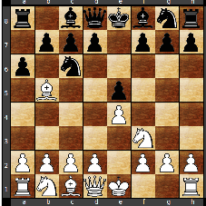
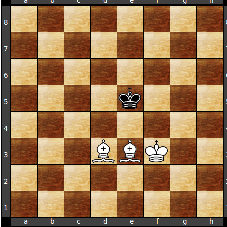

<!DOCTYPE html PUBLIC "-//W3C//DTD HTML 4.01 Transitional//EN"  
  "http://www.w3.org/TR/html4/loose.dtd">  
<html xml:lang="cs" > 
<head><title></title> 
<meta http-equiv="Content-Type" content="text/html; charset=iso-8859-2"> 
<meta name="generator" content="TeX4ht (http://www.cse.ohio-state.edu/~gurari/TeX4ht/)"> 
<meta name="originator" content="TeX4ht (http://www.cse.ohio-state.edu/~gurari/TeX4ht/)"> 
<!-- html --> 
<meta name="src" content="README.tex"> 
<meta name="date" content="2013-01-05 12:42:00"> 
<link rel="stylesheet" type="text/css" href="README.css"> 
</head><body 
>
<!--l. 11-->

<!--l. 12-->

<!--l. 13-->
<!--tex4ht:graphics  
name="README0x.png" src="zculogo.ps"  
-->
<!--l. 15-->
Semestrální práce z PC a PT 
Martin Zadra&#382;il 
5.&#x00A0;ledna 2013

   <h3 class="likesectionHead">Obsah</h3>
   

   1 <a 
href="#x1-20001" id="QQ2-1-2">Zadání</a>
    2 <a 
href="#x1-30002" id="QQ2-1-3">Anal&#x00FD;za úlohy</a>
    &#x00A0;2.1 <a 
href="#x1-40002.1" id="QQ2-1-4">Um&#x011B;lá inteligence a teorie &#353;achové hry</a>
    &#x00A0;&#x00A0;2.1.1 <a 
href="#x1-50002.1.1" id="QQ2-1-5">Od nejjednodu&#353;&#353;ího algoritmu ke kaskádové metod&#x011B;</a>
    &#x00A0;&#x00A0;2.1.2 <a 
href="#x1-60002.1.2" id="QQ2-1-6">Zpomalení je malé</a>
    &#x00A0;&#x00A0;2.1.3 <a 
href="#x1-70002.1.3" id="QQ2-1-7">Lep&#353;í &#x010D;asová kontrola</a>
    &#x00A0;&#x00A0;2.1.4 <a 
href="#x1-80002.1.4" id="QQ2-1-8">T&#x0159;íd&#x011B;ní tah&#x016F;</a>
    &#x00A0;&#x00A0;2.1.5 <a 
href="#x1-90002.1.5" id="QQ2-1-9">Metoda okénka</a>
    &#x00A0;&#x00A0;2.1.6 <a 
href="#x1-100002.1.6" id="QQ2-1-10">Prohlubování</a>
    &#x00A0;&#x00A0;2.1.7 <a 
href="#x1-110002.1.7" id="QQ2-1-11">Dopo&#x010D;et do tiché pozice</a>
    &#x00A0;&#x00A0;2.1.8 <a 
href="#x1-120002.1.8" id="QQ2-1-12">Prohlubování taktick&#x00FD;ch variant</a>
    &#x00A0;&#x00A0;2.1.9 <a 
href="#x1-130002.1.9" id="QQ2-1-13">Ha&#353; tabulky</a>
    &#x00A0;&#x00A0;2.1.10 <a 
href="#x1-140002.1.10" id="QQ2-1-14">Databáze zahájení a koncovek</a>
    &#x00A0;2.2 <a 
href="#x1-150002.2" id="QQ2-1-15">Reprezentace pozice</a>
    &#x00A0;2.3 <a 
href="#x1-160002.3" id="QQ2-1-16">Reprezentace pole tah&#x016F;</a>
    &#x00A0;2.4 <a 
href="#x1-170002.4" id="QQ2-1-17">Ohodnocovací funkce</a>
    3 <a 
href="#x1-180003" id="QQ2-1-18">Popis implementace</a>
    &#x00A0;3.1 <a 
href="#x1-190003.1" id="QQ2-1-19">Globální datové struktury</a>
    &#x00A0;3.2 <a 
href="#x1-200003.2" id="QQ2-1-20">Reprezentace &#353;achovnice, pozice a hodnot figur</a>
    &#x00A0;3.3 <a 
href="#x1-210003.3" id="QQ2-1-21">Reprezentace tahu a mno&#382;iny tah&#x016F;</a>
    &#x00A0;3.4 <a 
href="#x1-220003.4" id="QQ2-1-22">Statická ohodnocovací funkce</a>
    &#x00A0;3.5 <a 
href="#x1-230003.5" id="QQ2-1-23">Myslící algoritmus</a>
    4 <a 
href="#x1-240004" id="QQ2-1-24">U&#382;ivatelská p&#x0159;íru&#x010D;ka</a>
    &#x00A0;4.1 <a 
href="#x1-250004.1" id="QQ2-1-25">Instalace</a>
    &#x00A0;4.2 <a 
href="#x1-260004.2" id="QQ2-1-26">Ovládání</a>
    5 <a 
href="#x1-270005" id="QQ2-1-27">Záv&#x011B;r</a>
    &#x00A0;5.1 <a 
href="#x1-280005.1" id="QQ2-1-28">Problémy v pr&#x016F;b&#x011B;hu psaní programu</a>
    &#x00A0;5.2 <a 
href="#x1-290005.2" id="QQ2-1-29">Mo&#382;ná vylep&#353;ení</a>
   

   <h3 class="sectionHead">1    Zadání</h3>
<!--l. 27-->
Implementace jednoduchého &#353;achového algoritmu, kter&#x00FD; umo&#382;&#x0148;uje hru hrá&#x010D;e proti po&#x010D;íta&#x010D;i. Vstup
a v&#x00FD;stup bude probíhat na p&#x0159;íkazové &#x0159;ádce.
<!--l. 29-->

   <h3 class="sectionHead">2    Anal&#x00FD;za úlohy</h3>
<!--l. 31-->
Nejprve je pot&#x0159;eba navrhnout základní datové struktury a rutiny, které musí obsahovat ka&#382;d&#x00FD;
&#353;achov&#x00FD; program i takov&#x00FD;, kter&#x00FD; neobsahuje &#382;ádn&#x00FD; myslící algoritmus a umo&#382;&#x0148;uje nap&#x0159;íklad jen
hru dvou lidsk&#x00FD;ch hrá&#x010D;&#x016F; po síti. Pat&#x0159;í sem funkce pro
     <ul class="itemize1">
     <li class="itemize">Nalezení v&#353;ech legálních tah&#x016F; z dané pozice
     </li>
     <li class="itemize">Kontrola &#353;achu a matu
     </li>
     <li class="itemize">Funkce kontrolující dodr&#382;ení pravidel p&#x0159;i ro&#353;ád&#x011B; a braní mimochodem
     </li>
     <li class="itemize">Funkce, která zahraje samotn&#x00FD; tah</li></ul>
<!--l. 38-->
Bude následovat um&#x011B;lá inteligence a chyb&#x011B;t nesmí ani n&#x011B;kolik málo funkcí pro komunikaci s okolím,
jako je zparsování tahu zadaného z klávesnice, vypsání tahu, upozorn&#x011B;ní na p&#x0159;em&#x00FD;&#353;lení
programu a podobn&#x011B;.
<!--l. 40-->

   <h4 class="subsectionHead">2.1    Um&#x011B;lá inteligence a teorie &#353;achové hry</h4>
<!--l. 42-->

   <h5 class="subsubsectionHead">2.1.1    Od nejjednodu&#353;&#353;ího algoritmu ke kaskádové metod&#x011B;</h5>
<!--l. 43-->
&#352;achy jsou &#x010D;ist&#x011B; matematickou úlohou, k jejímu&#382; vy&#x0159;e&#353;ení se dá v ka&#382;dém p&#x0159;ípad&#x011B;
dopo&#x010D;ítat. Za vy&#x0159;e&#353;ení úlohy m&#x016F;&#382;eme pova&#382;ovat mat v p&#x0159;ípad&#x011B; vyhrané pozice, pat v
p&#x0159;ípad&#x011B; remízové pozice nebo alespo&#x0148; co nejv&#x011B;t&#353;í oddalování porá&#382;ky v p&#x0159;ípad&#x011B;
prohrané pozice. Klí&#x010D;ovou funkcí je statická ohodnocovací funkce, která vrátí &#x010D;íselnou
hodnotu dané pozice. Nejednodu&#353;&#353;í algoritmus, kter&#x00FD; nehraje úpln&#x011B; náhodn&#x011B;, vygeneruje
v&#353;echny tahy ze zadané pozice, ka&#382;d&#x00FD; z nich zahraje a vzniklou pozici ohodnotí statickou
ohodnocovací funkcí. Pokud je hodnota pozice vy&#353;&#353;í ne&#382; dosud nejvy&#353;&#353;í, ulo&#382;í ji i tah, kter&#x00FD;m
jsme se na ni dostali. Poté zahraje tah zp&#x011B;t a tak dále, dokud nevyzkou&#353;íme v&#353;echny
tahy. Tento algoritmus je sice lep&#353;í ne&#382; náhodné generování tah&#x016F;, ale díru do sv&#x011B;ta
rozhodn&#x011B; neud&#x011B;lá. Sebere klidn&#x011B; dámou krytého p&#x011B;&#353;ce, nepokryje jednotahov&#x00FD; mat a
podobn&#x011B;.

<!--l. 45-->
   Vylep&#353;ením je p&#x0159;idat rekurzi. Zahrajeme v&#353;echny tahy z dané pozice, na tyto tahy zahrajeme
odpov&#x011B;&#x010F; soupe&#x0159;e, pak zase na&#353;í odpov&#x011B;&#x010F; a tak dále a&#382; do n&#x011B;jaké hloubky n, kde zavoláme
statickou ohodnocovací funkci. Tento algoritmus se jmenuje minimax. Na &#353;achovnici je v
základním postavení 16 p&#x011B;&#353;c&#x016F;, ka&#382;d&#x00FD; z nich m&#x016F;&#382;e táhnout nejv&#x00FD;&#353;e &#353;estkrát, poté se prom&#x011B;ní v
n&#x011B;jakou figuru. Kdy&#382; nepo&#x010D;ítáme krále, které není mo&#382;né sebrat, je na &#353;achovnici 30 figur a ka&#382;dá
z nich m&#x016F;&#382;e b&#x00FD;t sebrána maximáln&#x011B; jednou. Pokud se b&#x011B;hem 50ti tah&#x016F; (50 tah&#x016F; bílého a
50 tah&#x016F; &#x010D;erného, celkem 100 p&#x016F;ltah&#x016F;) netáhne p&#x011B;&#353;cem ani nesebere &#382;ádná figura, je
partie pova&#382;ovaná za remízu. Díky tomu m&#x016F;&#382;eme shora odhadnout hloubku &#353;achové
partie na (16 * 6 + 30 + 1) * 100 = 12700 p&#x016F;ltah&#x016F;. Algoritmus minimax s hloubkou
propo&#x010D;tu 12700 bude teoreticky hrát &#353;achy úpln&#x011B; dokonale, alespo&#x0148; v tom smyslu, &#382;e
&#382;ádnou remízovou pozici neprohraje, ka&#382;dou vyhranou pozici nejen vyhraje, ale dokonce
tím nejrychlej&#353;ím zp&#x016F;sobem a p&#x0159;i prohrané pozici bude porá&#382;ku alespo&#x0148; maximáln&#x011B;
oddalovat.
<!--l. 47-->
   Pam&#x011B;&#x0165;ová slo&#382;itost minimaxu není p&#x0159;íli&#353; velká, nebo&#x0165; v zásobníku rekurzivního propo&#x010D;tu je
v danou chvíli pouze jedna varianta. Kdyby se tedy minimaxu opravdu poda&#x0159;ilo nalézt variantu
dlouhou 12 700 p&#x016F;ltah&#x016F; a jedna instance minimaxu zabrala 1 kB, ve&#353;li bychom se i s volajícím
kódem pohodln&#x011B; do 13 MB. Na propo&#x010D;et stromu tak bohaté hry, jakou &#353;achy bezesporu jsou, nám
tedy sta&#x010D;í pouze pár megabajt&#x016F; opera&#x010D;ní pam&#x011B;ti. Bohu&#382;el &#x010D;asová slo&#382;itost minimaxu je
exponenciální vh
, kde v je v&#x011B;tvící faktor a h hloubka propo&#x010D;tu. P&#x0159;edpokládejme, &#382;e z pozice m&#x016F;&#382;eme vygenerovat
20 tah&#x016F; (nap&#x0159;íklad z v&#x00FD;chozího postavení 16 tah&#x016F; p&#x011B;&#353;ci, 4 tahy jezdci) a &#382;e doká&#382;eme spo&#x010D;ítat
milion ohodnocovacích funkcí za sekundu. Propo&#x010D;et do hloubky 2 pak potrvá 0,008 sekundy,
propo&#x010D;et do hloubky 5 3,2 sekundy, propo&#x010D;et do hloubky 10 zhruba 118 a p&#x016F;l dne. P&#x0159;i hloubce 12
700 by to pak bylo 3,81 * 1016509
let, konce v&#x00FD;po&#x010D;tu by se tedy nejspí&#353; nedo&#x010D;kala ani na&#353;e galaxie.
<!--l. 49-->
   &#x010C;asovou slo&#382;itost m&#x016F;&#382;eme zlep&#353;it. Pot&#x0159;ebujeme-li zmen&#353;it v&#x00FD;sledek vzorce vh
, m&#x016F;&#382;eme zmen&#353;ovat h, co&#382; je hloubka propo&#x010D;tu a na kvalitu hry má zásadní vliv. Druhou
mo&#382;ností je zmen&#353;it v, co&#382; je v&#x011B;tvící faktor a n&#x011B;které varianty v&#x016F;bec nepo&#x010D;ítat. I p&#x0159;esto se
m&#x016F;&#382;eme dostat ke správnému v&#x00FD;sledku.

<!--l. 51-->

<!--l. 52-->
<!--tex4ht:graphics  
name="README1x.png" src="diagram1.ps"  
-->

<!--l. 55-->
   V pozici na diagramu je na tahu bíl&#x00FD;, jedná se o známou pozici ze zahájení jménem &#353;pan&#x011B;lská
hra (1. e4 e5 2. Jf3 Jc6 3. Sb5), kde se &#x010D;ern&#x00FD; brání obvykl&#x00FD;m tahem 3. ...a6. Napadl
tedy bílému st&#x0159;elce a ten musí hrozbu n&#x011B;jak pokr&#x00FD;t. B&#x011B;&#382;né tahy jsou nyní 4. Sa4 a
Sxc6, hrát by se dalo i Sc4 a snad je&#353;t&#x011B; hodn&#x011B; defétistické Se2, v&#353;echny ostatní tahy
jsou ji&#382; vylo&#382;en&#x011B; &#353;patné. Z této pozice dáme programu za úkol provést propo&#x010D;et do
hloubky 2 p&#x016F;ltahy. Vygeneruje tahy a zkou&#353;í jeden po druhém zahrát. Generátor tah&#x016F; je
lehce modifikovan&#x00FD;, tak aby vracel braní p&#x0159;ed ostatními tahy. Program tedy nejprve
propo&#x010D;ítá 4. Sxc6, projde v&#353;echny odpov&#x011B;di &#x010D;erného a zjistí, &#382;e po nejlep&#353;ím 4. ...dxc6 je
pozice p&#x0159;ibli&#382;n&#x011B; vyrovnaná. Bíl&#x00FD; sice ztratil v&#x00FD;hodu dvojice st&#x0159;elc&#x016F;, ale zase &#x010D;ernému
znehodnotil p&#x011B;&#353;covou strukturu. Ohodnocení prvního tahu zatím prob&#x011B;hlo tak, jako
v algoritmu minimax. Rozdíl nastane a&#382; u druhého tahu bílého 4. Sxa6. Jedná se o
zjevnou chybu, kterou bíl&#x00FD; odevzdává st&#x0159;elce za pouhého p&#x011B;&#353;ce, ale minimax by musel
projít v&#353;echny odpov&#x011B;di, aby si to uv&#x011B;domil. Tedy poctiv&#x011B; po&#x010D;ítat a ohodnocovat nejen
4. ...bxa6 a Vxa6, ale i zcela nesmyslné tahy jako 4. ...Jh6 nebo g5. Modifikovanému
algoritmu sta&#x010D;í jediná: 4. ...Vxa6 nebo bxa6. Navíc generátor tah&#x016F;, kter&#x00FD; preferuje braní,
vrátí jeden z uveden&#x00FD;ch tah&#x016F; hned jako první. Jak program pozná, &#382;e m&#x016F;&#382;e propo&#x010D;et
odpov&#x011B;dí na 4. Sxa6 p&#x0159;eru&#353;it a prohlásit tah za neperspektivní? Z propo&#x010D;tu 4. Sxc6 si
zapamatoval hodnotu nejlep&#353;í odpov&#x011B;di 4. ...dxc6, tedy zhruba 0 tj. vyrovnanou pozici. P&#x0159;i
propo&#x010D;tu dal&#353;ích tah&#x016F; (4. Sxa6) uvedenou hodnotu pou&#382;ijeme jako práh. Pokud jej jakákoli
odpov&#x011B;&#x010F; (4. ...bxa6 nebo Vxa6) p&#x0159;esáhne, propo&#x010D;et tahu (4. Sxa6) ukon&#x010D;íme, nebo&#x0165; ji&#382;
víme, &#382;e je &#353;patn&#x00FD;. Jin&#x00FD;mi slovy: pokud víme, &#382;e tah je &#353;patn&#x00FD; (= hor&#353;í ne&#382; n&#x011B;jak&#x00FD;
jin&#x00FD; - zde 4. Sxc6), nemá smysl dále zkoumat, jestli není náhodou je&#353;t&#x011B; o n&#x011B;co hor&#353;í,
ne&#382; jsme zatím zjistili. Pokud po&#x010D;ítáme do hloubky 3 a více, dojde p&#x0159;i pro&#x0159;ezávání
na oba hrá&#x010D;e a jsou zde proto meze pro ob&#x011B; strany. Dolní se &#x0159;íká alfa, horní beta,
odtud také název algoritmu alfabeta metoda (nebo alfabeta o&#x0159;ezávání). Pokud b&#x011B;hem
propo&#x010D;tu narazíme na variantu, která je hor&#353;í ne&#382; alfa, m&#x016F;&#382;eme ji zahodit. Vyjde-li
nám varianta lep&#353;í ne&#382; beta, m&#x016F;&#382;e se jí zase vyhnout soupe&#x0159; a zahrát tah, kter&#x00FD; je
lep&#353;í pro n&#x011B;j. &#x010C;asová slo&#382;itost alfabety siln&#x011B; závisí na po&#x0159;adí tah&#x016F;, co&#382; ovliv&#x0148;uje, jak
rychle se nám poda&#x0159;í sev&#x0159;ít meze alfa a beta. &#x010C;asová slo&#382;itost optimální alfabety je

vh&#x2215;2
, m&#x016F;&#382;eme se s ní tedy za stejn&#x00FD; &#x010D;as dostat dvakrát hloub&#x011B;ji ne&#382; s minimaxem. Je tedy &#382;ádoucí
aby nejnad&#x011B;jn&#x011B;j&#353;í varianty po&#x010D;ítal algoritmus jako první. Existuje n&#x011B;kolik heuristik, jak
odhadnout u&#382; v generátoru tah&#x016F;, které varianty by mohly b&#x00FD;t nejlep&#353;í:
     <ul class="itemize1">
     <li class="itemize">Se&#382;er co m&#x016F;&#382;e&#353;: Zp&#x016F;sobí-li tah zm&#x011B;nu materiálu, posuneme ho na více dop&#x0159;edu.
     Preferovat m&#x016F;&#382;eme rovn&#x011B;&#382; braní ni&#382;&#353;í figurou.
     </li>
     <li class="itemize">Historická heuristika je zalo&#382;ena na my&#353;lence, &#382;e pokud byl tah dobr&#x00FD; v jedné variant&#x011B;,
     nejspí&#353; bude dobr&#x00FD; i v jiné. T&#x0159;i typy této metody mohou b&#x00FD;t:
     </li>
     <li class="itemize">Globální tabulka tah&#x016F;: Program si musí n&#x011B;jak pamatovat tahy. Informace odkud a
     kam se táhne, p&#x0159;ípadn&#x011B; typ nové figury po prom&#x011B;n&#x011B; p&#x011B;&#353;ce se p&#x0159;i tro&#353;e snahy vejde
     do 16 bit&#x016F;. Vytvo&#x0159;íme si tedy pole velikosti 216, pro ka&#382;d&#x00FD; mo&#382;n&#x00FD; tah jeden byte.
     Na po&#x010D;átku propo&#x010D;tu pole obsahuje samé nuly. Kdy&#382; se n&#x011B;jak&#x00FD; tah uká&#382;e jako dobr&#x00FD;
     (v&#x011B;t&#353;í ne&#382; aktuální hodnota alfa). Zv&#x011B;t&#353;ím hodnotu jeho polí&#x010D;ka v poli. Kdy&#382; potom
     po vygenerování t&#x0159;ídíme tahy, uva&#382;ujeme je&#353;t&#x011B; také hodnotu této heuristiky. Jak
     p&#x0159;esn&#x011B; se mají zv&#x011B;t&#353;ovat hodnoty v tabulce je slo&#382;itá otázka. Je z&#x0159;ejmé, &#382;e dobré tahy
     z pozic vzdálen&#x011B;j&#353;ích od ko&#x0159;ene mají men&#353;í v&#x00FD;znam ne&#382; dobré tahy z pozic blízk&#x00FD;ch
     ko&#x0159;eni. Je to tím, &#382;e pr&#x016F;m&#x011B;rná pozice z propo&#x010D;tu je bli&#382;&#353;í ko&#x0159;eni ne&#382; n&#x011B;jakému listu
     ze vzdálené v&#x011B;tve.
     </li>
     <li class="itemize">Nejlep&#353;í  tahy  pro  danou  hloubku:  Pro  ka&#382;dou  hloubku  zano&#x0159;ení  v  propo&#x010D;tu  si
     zapamatujeme  poslední  dva  zlep&#353;ující  tahy.  Tyto  tahy  dostanou  p&#x0159;i  propo&#x010D;tu  v
     tomto zano&#x0159;ení speciální bonus. Oproti globální tabulce má metoda tu v&#x00FD;hodu, &#382;e
     se více t&#x00FD;ká aktuální pozice a p&#x0159;íslu&#353;né hloubky, chová se tedy lokáln&#x011B;. Tím pádem
     v&#x011B;t&#353;inou preferuje zlep&#353;ující tahy z blízk&#x00FD;ch uzl&#x016F; a u nich je opravdu dost velká
     pravd&#x011B;podobnost, &#382;e budou dobré i v po&#x010D;ítané pozici. Nev&#x00FD;hodou je, &#382;e ohodnocuje
     jen relativn&#x011B; málo tah&#x016F; (p&#x0159;esn&#x011B; 2).
     </li>
     <li class="itemize">Hlavní varianta: Program si uchovává v tabulce dosavadní hlavní variantu, tedy v&#x011B;tev
     v&#x00FD;po&#x010D;tu p&#x0159;i optimální h&#x0159;e (optimální ve smyslu ohodnoceni list&#x016F;) obou hrá&#x010D;&#x016F;. Tah,
     kter&#x00FD; p&#x0159;íslu&#353;í k hlavní variant&#x011B; bude z&#x0159;ejm&#x011B; dobr&#x00FD; i v celé &#x0159;ad&#x011B; jin&#x00FD;ch variant, a proto
     získává bonus. Varianty se ukládají do matice, vyu&#382;ívá se ale jen horní trojúhelník.
     V jednom polí&#x010D;ku matice je jeden tah. Jsme-li p&#x0159;i propo&#x010D;tu v n&#x011B;jakém uzlu, po&#x010D;ítáme
     v tomto okam&#382;iku vlastn&#x011B; hodnotu v&#353;ech pozic na cest&#x011B; z ko&#x0159;ene do na&#353;eho uzlu. V
     i-tém &#x0159;ádku (od diagonály dál) si uchováváme nejlep&#353;í dosavadní variantu z i-té pozice
     na cest&#x011B; od ko&#x0159;ene. Dejme tomu, &#382;e v hloubce i do&#353;lo k nalezení zlep&#353;ujícího tahu.
     V &#x0159;ádku i máme p&#x016F;vodní nejlep&#353;í variantu (od na&#353;í pozice dál) a v &#x0159;ádku i+1 je
     zlep&#353;ující varianta.. Za této situace musíme zkopírovat i+1-ní &#x0159;ádek na pozici i-tého
     (z n&#x011B;j z&#x016F;stane jen první tah na diagonále).</li></ul>
<!--l. 64-->
Nev&#x00FD;hodou alfabety je její pevná hloubka. Jsme-li v zahájení nebo st&#x0159;ední h&#x0159;e, bude tah&#x016F; k
ohodnocení velmi mnoho. Hloubka v&#x00FD;po&#x010D;tu v této &#x010D;ásti hry by tedy nem&#x011B;la b&#x00FD;t p&#x0159;íli&#353; vysoká,

jinak se k v&#x00FD;sledku nedopo&#x010D;ítáme v rozumném &#x010D;ase. Naopak v koncovce, kdy je pouze pár
p&#x0159;ípustn&#x00FD;ch tah&#x016F; lze hloubku propo&#x010D;tu zv&#x00FD;&#353;it. Tento problém &#x0159;e&#353;í kaskádová metoda. Jedná se
vlastn&#x011B; o alfabeta metodu, která postupn&#x011B; po&#x010D;ítá do hloubky 1,2,3,...,n. Na první pohled se
m&#x016F;&#382;e zdát zbyte&#x010D;né po&#x010D;ítat poka&#382;dé znovu, nicmén&#x011B; kaskádová metoda má n&#x011B;kolik
v&#x00FD;hod:
<!--l. 67-->

   <h5 class="subsubsectionHead">2.1.2    Zpomalení je malé</h5>
<!--l. 69-->
Proto&#382;e je slo&#382;itost alfabety exponenciální, zpomalí kaskádová metoda program cca
jeden a p&#x016F;l krát. Dejme tomu, &#382;e pr&#x016F;m&#x011B;rn&#x00FD; v&#x011B;tvící faktor &#353;achu je 38, p&#x0159;i dobrém
alfabeta o&#x0159;ezávání se dostaneme na v&#x011B;tvící faktor zhruba odmocnina z 38, dejme tomu 7.
!7n-1
je zhruba o &#x0159;ád men&#353;í ne&#382; 7n
.
<!--l. 71-->

   <h5 class="subsubsectionHead">2.1.3    Lep&#353;í &#x010D;asová kontrola</h5>
<!--l. 73-->
V praxi obvykle nezní zadání &#8221;=ldej mi nejlep&#353;í tah do hloubky 5&#8220;, ale &#8221;=ldej mi nejlep&#353;í tah,
má&#353; na to 5 sekund&#8220;. Potom je velmi obtí&#382;né stanovit hloubku propo&#x010D;tu, které dosáhneme v
daném &#x010D;ase. U kaskádové metody prost&#x011B; provádíme iterace tak dlouho, dokud máme &#x010D;as. To nám
práv&#x011B; umo&#382;ní v koncovce (p&#x0159;ípadn&#x011B; kdykoliv, kdy&#382; je mno&#382;ina mo&#382;n&#x00FD;ch tah&#x016F; dostate&#x010D;n&#x011B; malá)
po&#x010D;ítat do v&#x011B;t&#353;í hloubky.
<!--l. 75-->

   <h5 class="subsubsectionHead">2.1.4    T&#x0159;íd&#x011B;ní tah&#x016F;</h5>
<!--l. 77-->
Kaskádová metoda poskytuje lep&#353;í mo&#382;nosti t&#x0159;íd&#x011B;ní tah&#x016F;. Propo&#x010D;et do hloubky 1 za&#x010D;neme s
tahy set&#x0159;íd&#x011B;n&#x00FD;mi podle jednoduch&#x00FD;ch heuristik v generátoru tah&#x016F;. Nejlep&#353;í tah poté p&#x0159;emístíme
na za&#x010D;átek, pokra&#x010D;ujeme propo&#x010D;tem do hloubky 2, nejlep&#353;í taj z hloubky 2 op&#x011B;t p&#x0159;emístíme na
za&#x010D;átek a tak dále. Tím se nám poda&#x0159;í velmi rychle sev&#x0159;ít interval alfa a beta okolo
nejnad&#x011B;jn&#x011B;j&#353;ích tah&#x016F;, co&#382; kaskádovou metodu je&#353;t&#x011B; dále zrychlí. P&#x0159;ípad&#x016F;, kdy zahájíme
propo&#x010D;et n&#x011B;kolika &#353;patn&#x00FD;mi tahy bude velmi málo - obvykle se jedná o pozice s mo&#382;ností slo&#382;ité
ob&#x011B;ti nebo komplikovaného tahu.
<!--l. 79-->

   <h5 class="subsubsectionHead">2.1.5    Metoda okénka</h5>
<!--l. 81-->
Alfabeta metoda svírá interval alfa a beta velmi defenzivn&#x011B; - tak aby se v&#382;dy dopo&#x010D;ítala ke
správnému v&#x00FD;sledku. Cel&#x00FD; v&#x00FD;po&#x010D;et m&#x016F;&#382;eme zrychlit tím, &#382;e meze alfa a beta je&#353;t&#x011B; více sev&#x0159;eme -
vytvo&#x0159;íme interval alfa2 a beta2, kter&#x00FD; bude podmno&#382;inou p&#x016F;vodního alfa a beta.
Pokud jsme m&#x011B;li pravdu, u&#353;et&#x0159;ili jsme na v&#x00FD;po&#x010D;tu n&#x011B;jak&#x00FD; &#x010D;as, pokud ne, interval prost&#x011B;
p&#x0159;ete&#x010D;e a v následující iteraci kaskádové metody se po&#x010D;ítá interval s ji&#382; opraven&#x00FD;mi
mezemi.

<!--l. 83-->

   <h5 class="subsubsectionHead">2.1.6    Prohlubování</h5>
<!--l. 85-->
Herní algoritmus po&#x010D;ítá do n&#x011B;jaké hloubky, na jejím&#382; konci ohodnotí pozici statickou
ohodnocovací funkcí. Tento postup dob&#x0159;e funguje v b&#x011B;&#382;n&#x00FD;ch pozicích, ale v taktick&#x00FD;ch pozicích
(jako je v&#x00FD;m&#x011B;na t&#x011B;&#382;k&#x00FD;ch figur, pozice tah p&#x0159;ed matem, kdy vít&#x011B;zná strana ob&#x011B;tovala materiál,
atp.) selhává. P&#x0159;itom by zde sta&#x010D;ila o n&#x011B;co málo v&#x011B;t&#353;í hloubka propo&#x010D;tu a program by
hrozby v&#x010D;as vid&#x011B;l. Celkovou hloubku propo&#x010D;tu nem&#x016F;&#382;eme p&#x0159;íli&#353; zvy&#353;ovat - program
by se nedopo&#x010D;ítal. &#x0158;e&#353;ením je tedy prohloubení t&#x011B;ch variant, které jsou obzvlá&#353;t&#x011B;
zajímavé.
<!--l. 87-->

   <h5 class="subsubsectionHead">2.1.7    Dopo&#x010D;et do tiché pozice</h5>
<!--l. 89-->
Dopo&#x010D;et do tiché pozice pat&#x0159;í v &#353;achu k nejjednodu&#353;&#353;ím a zárove&#x0148; nejd&#x016F;le&#382;it&#x011B;j&#353;ím vylep&#353;ením
alfabeta metody. Na úrove&#x0148; hry programu má zcela zásadní vliv. Spo&#x010D;ívá v tom, &#382;e pokud se v
propo&#x010D;tu dostaneme do listu, neodhadujeme hodnotu pozice statickou ohodnocovací funkcí, ale
jakousi modifikací alfabety, která se li&#353;í tím &#382;e bere v úvahu pouze braní a prom&#x011B;ny p&#x011B;&#353;ce.
Vzhledem k tomu, &#382;e hrá&#x010D;i odepíráme v&#353;echny ostatní tahy (tzv. tiché tahy), musíme mu
umo&#382;nit nehrát, jinak bychom jej nutili i do nev&#x00FD;hodn&#x00FD;ch braní. Funkce tedy vrací maximum z
hodnoty pozice odhadnuté statickou ohodnocovací funkcí a rekurzivního dopo&#x010D;tu braní. Práv&#x011B;
dopo&#x010D;et do tiché pozice &#x0159;e&#353;í p&#x0159;ípady nedopo&#x010D;ítan&#x00FD;ch v&#x00FD;m&#x011B;n. Dopo&#x010D;et samoz&#x0159;ejm&#x011B; hodn&#x011B;
zdr&#382;uje a sní&#382;í základní hloubku propo&#x010D;tu, ale pozitivní efekt je i tak obrovsk&#x00FD;. Dopo&#x010D;et do
tiché pozice má navíc kladn&#x00FD; vliv i na stabilitu v&#x00FD;po&#x010D;tu - ji&#382; se nám nestane p&#x0159;íli&#353;
&#x010D;asto, &#382;e by zv&#x00FD;&#353;ení základní hloubky propo&#x010D;tu m&#x011B;lo n&#x011B;jak&#x00FD; zásadní vliv na hodnotu
varianty.
<!--l. 91-->

   <h5 class="subsubsectionHead">2.1.8    Prohlubování taktick&#x00FD;ch variant</h5>
<!--l. 93-->
Dopo&#x010D;et do tiché pozice je ú&#x010D;inn&#x00FD;, ale ne&#x0159;e&#353;í v&#353;e. Ve zvlá&#353;&#x0165; nad&#x011B;jn&#x00FD;ch variantách b&#x00FD;vá dobré
hloubku propo&#x010D;tu o jedni&#x010D;ku zv&#x00FD;&#353;it a nemusí se p&#x0159;i tom nutn&#x011B; jednat o braní nebo
prom&#x011B;ny p&#x011B;&#353;ce. K prohloubení také nemusí dojit jen v listu. Kdy p&#x0159;esn&#x011B; má smysl
prohlubovat je slo&#382;itá otázka. Za typické kandidáty na prohloubení m&#x016F;&#382;eme ozna&#x010D;it
tahy
     <ul class="itemize1">
     <li class="itemize">Kdy je sebraná figura, která v minulém tahu sama brala (m&#x016F;&#382;e se jednat o dokon&#x010D;ení
     v&#x00FD;m&#x011B;ny)
     </li>
     <li class="itemize">Pokrytí  &#353;achu  p&#x0159;edstavením  (m&#x016F;&#382;e  b&#x00FD;t  jen  oddálením  matu  skr&#x00FD;vajícího  se  za
     horizontem propo&#x010D;tu)
     </li>
     <li class="itemize">Jakékoliv varianty s vynucen&#x00FD;mi tahy
     </li>
     <li class="itemize">Vidle p&#x011B;&#353;cem i jezdcem a podobné taktické údery

     </li>
     <li class="itemize">Varianty s tzv. Fisherov&#x00FD;m st&#x0159;elcem
     </li>
     <li class="itemize">Taktické hrozby králi</li></ul>
<!--l. 102-->
P&#x0159;i prohlubování je pot&#x0159;eba postupovat velmi obez&#x0159;etn&#x011B;, nebo&#x0165; prohloubení jedné varianty zkrátí
v&#x00FD;po&#x010D;etní &#x010D;as ostatních variant.
<!--l. 104-->

   <h5 class="subsubsectionHead">2.1.9    Ha&#353; tabulky</h5>
<!--l. 106-->
Dote&#x010F; jsme se sna&#382;ili zrychlit v&#x00FD;po&#x010D;et pomocí o&#x0159;ezávání a svírali jsme interval alfa a beta jak to
jen &#353;lo, abychom od&#x0159;ízli co nejvy&#353;&#353;í po&#x010D;et variant, které nemá cenu po&#x010D;ítat. Existuje v&#353;ak je&#353;t&#x011B;
jeden druh variant, které rovn&#x011B;&#382; nemusíme po&#x010D;ítat. Jde o dvojce variant, které se od
sebe li&#353;í pouh&#x00FD;m prohozením tah&#x016F;. Pokud program po&#x010D;ítá do hloubky 5 p&#x016F;ltah&#x016F; ze
základního postavení, nevynechá ani variantu bíl&#x00FD; p&#x011B;&#353;ec na e4, &#x010D;ern&#x00FD; p&#x011B;&#353;ec na c5 v prvním
tahu, bíl&#x00FD; jezdec na f3 v druhém tahu a z této pozice pozice po&#x010D;ítá je&#353;t&#x011B; do zb&#x00FD;vající
hloubky 2 p&#x016F;ltahy. Ke stejnému v&#x00FD;sledku se v&#353;ak dostane i z pozice, kdy v prvním
tahu p&#x0159;ijde bíl&#x00FD; jezdec na f3 a &#x010D;ern&#x00FD; p&#x011B;&#353;ec na c5 a ve druhém tahu bíl&#x00FD; p&#x011B;&#353;ec na e4.
Následující dva p&#x016F;ltahy se budou po&#x010D;ítat znovu. Je p&#x0159;itom z&#x0159;ejmé, &#382;e vzniklou pozici sta&#x010D;í
zkoumat jen jednou. V zahájení a st&#x0159;ední h&#x0159;e s velk&#x00FD;m po&#x010D;tem figur a malou hloubkou
propo&#x010D;tu dochází k t&#x011B;mto duplicitám je&#353;t&#x011B; pom&#x011B;rn&#x011B; z&#x0159;ídka. Mnohem hor&#353;í je situace v
koncovce s mal&#x00FD;m po&#x010D;tem figur. Typick&#x00FD;m p&#x0159;íkladem je koncovka dvou král&#x016F;, v ní&#382;
mají ob&#x011B; strany u&#382; jen n&#x011B;kolik zablokovan&#x00FD;ch p&#x011B;&#353;c&#x016F;. Král se obvykle sna&#382;í vytla&#x010D;it
soupe&#x0159;ova monarchu (obvykle i s vyu&#382;itím nev&#x00FD;hody tahu), pobrat soupe&#x0159;ovy p&#x011B;&#353;ce a
prosadit ty své do dámy. Ob&#x011B; strany p&#x0159;itom mají na v&#x00FD;b&#x011B;r jen n&#x011B;kolik málo p&#x0159;ípustn&#x00FD;ch
tah&#x016F;, a tak hloubka propo&#x010D;tu roste oproti st&#x0159;ední h&#x0159;e i dvojnásobn&#x011B;. P&#x0159;i podobn&#x00FD;ch
hlubok&#x00FD;ch propo&#x010D;tech dochází k opakovanému vyhodnocování jedné varianty vzniklé jen
p&#x0159;ehozením tah&#x016F; zcela b&#x011B;&#382;n&#x011B;. Práv&#x011B; v podobn&#x00FD;ch typech pozic p&#x0159;itom m&#x016F;&#382;e mít
po&#x010D;íta&#x010D; s lidsk&#x00FD;m soupe&#x0159;em problémy. Jednoduch&#x00FD; charakter pozice toti&#382; umo&#382;ní lépe
oprostit plán v&#x00FD;hry nebo obrany od detailního propo&#x010D;tu (p&#x0159;ípadn&#x011B; lidsk&#x00FD; propo&#x010D;et
degeneruje na jedinou, ale zato dlouhou variantu bez v&#x011B;tvení) a umo&#382;ní vid&#x011B;t mnohem dál i
&#x010D;lov&#x011B;ku.
<!--l. 109-->
   &#x0158;e&#353;ením je mít ha&#353; tabulku s v&#x00FD;sledky jednotliv&#x00FD;ch v&#x00FD;po&#x010D;t&#x016F;, do které se podíváme a pokud
zde v&#x00FD;sledek propo&#x010D;tu z na&#353;í pozice najdeme, okam&#382;it&#x011B; ho vrátíme. Je pot&#x0159;eba dát pozor na
n&#x011B;kolik v&#x011B;cí:
     <ul class="itemize1">
     <li class="itemize">Ukládat  je  pot&#x0159;eba  i  hloubku  propo&#x010D;tu,  nebo&#x0165;  nelze  nahradit  propo&#x010D;et  v&#x00FD;sledkem
     p&#x0159;edchozího propo&#x010D;tu do men&#353;í hloubky.
     </li>
     <li class="itemize">Alfabeta nedává jen meziv&#x00FD;sledky typu pozice má cenu = 3, ale i pozice má cenu ¡= 3
     nebo pozice má cenu =¿ 3. Tyto meziv&#x00FD;sledky je rovn&#x011B;&#382; pot&#x0159;eba ukládat.
     </li>
     <li class="itemize">Musíme pracovat velmi rychle s velk&#x00FD;m mno&#382;stvím dat.

     </li>
     <li class="itemize">Program by nem&#x011B;l &#x010D;íst z disku - struktura se musí za ka&#382;dou cenu vejít do pam&#x011B;ti.
     </li>
     <li class="itemize">Je lep&#353;í, kdy&#382; struktura zapomíná ne&#382; aby swapovala
     </li>
     <li class="itemize">Pozice  obsahuje  64  polí  a  stavovou  informaci  o  tahu,  právu  na  ro&#353;ády  a  braní
     mimochodem, ale jeden záznam ve struktu&#x0159;e by m&#x011B;l mít Jen n&#x011B;kolik byt&#x016F;, proto
     volíme ha&#353; tabulku.</li></ul>
<!--l. 119-->
   V této ha&#353; tabulce nemusíme &#x0159;e&#353;it kolize - nová nebo cenn&#x011B;j&#353;í hodnota prost&#x011B; p&#x0159;epí&#353;e starou.
Je to rychlej&#353;í a jednodu&#353;&#353;í ne&#382; na jednotliv&#x00FD;ch prvcích vytvá&#x0159;et spojové seznamy a zab&#x00FD;vat se
alokováním a uvol&#x0148;ováním pam&#x011B;ti
     <ul class="itemize1">
     <li class="itemize">Je lep&#353;í, kdy&#382; struktura zapomíná ne&#382; aby swapovala
     </li>
     <li class="itemize">Pozice  obsahuje  64  polí  a  stavovou  informaci  o  tahu,  právu  na  ro&#353;ády  a  braní
     mimochodem, ale jeden záznam ve struktu&#x0159;e by m&#x011B;l mít jen n&#x011B;kolik byt&#x016F;, proto volíme
     ha&#353; tabulku.</li></ul>
<!--l. 125-->
   V této ha&#353; tabulce nemusíme &#x0159;e&#353;it kolize - nová nebo cenn&#x011B;j&#353;í hodnota prost&#x011B; p&#x0159;epí&#353;e starou.
Je to rychlej&#353;í a jednodu&#353;&#353;í ne&#382; na jednotliv&#x00FD;ch prvcích vytvá&#x0159;et spojové seznamy a zab&#x00FD;vat se
alokováním a uvol&#x0148;ováním pam&#x011B;ti.
<!--l. 127-->

   <h5 class="subsubsectionHead">2.1.10    Databáze zahájení a koncovek</h5>
<!--l. 129-->
Ka&#382;dá &#353;achová partie za&#x010D;íná v&#382;dy stejnou pozicí. Je celkem pochopitelné, &#382;e &#353;achisté velmi
pe&#x010D;liv&#x011B; studují jednotlivé varianty vzniklé ze základního postavení ji&#382; v klidu doma s
po&#x010D;íta&#x010D;em nebo v klubu b&#x011B;hem tréninku a ne a&#382; v omezeném &#x010D;ase b&#x011B;hem partie. O
konkrétních zahájeních byly napsány stovky knih, v&#x011B;novali se jim ti nejlep&#353;í &#353;achisté
teoretici. B&#x011B;hem zahájení b&#x011B;&#382;n&#x011B; vznikají velmi komplikované pozice, ve kter&#x00FD;ch se
nevyznají ani velmist&#x0159;i, a malá nenápadná a t&#x011B;&#382;ko odhalitelná chyba m&#x016F;&#382;e vést k rychlé
proh&#x0159;e nebo alespo&#x0148; k v&#x00FD;hod&#x011B; soupe&#x0159;e. Rozmotat p&#x0159;ímo za &#353;achovnicí n&#x011B;kolik del&#353;ích a
trochu rozv&#x011B;tven&#x00FD;ch vynucen&#x00FD;ch variant (které b&#x011B;hem desítek let vymysleli &#353;achoví
teoretici) b&#x00FD;vá bez p&#x0159;edchozí p&#x0159;ípravy nad síly i t&#x011B;ch nejlep&#353;ích hrá&#x010D;&#x016F; a dne&#353;ních
program&#x016F;, ale nau&#x010D;it se &#x0159;e&#353;ení nazpam&#x011B;&#x0165; a pochopit ho se doká&#382;e p&#x0159;i tro&#353;e snahy i
pr&#x016F;m&#x011B;rn&#x00FD; klubov&#x00FD; &#353;achista nebo t&#x0159;eba ná&#353; program. Program nau&#x010D;íme zahájení tak, &#382;e
n&#x011B;kam ulo&#382;íme pozice b&#x011B;&#382;né v zahájení a/nebo jejich ha&#353; funkce a k nim sadu tah&#x016F;,
které od programu v uvedené pozici o&#x010D;ekáváme. Ka&#382;dému tahu zárove&#x0148; p&#x0159;i&#x0159;adíme
pravd&#x011B;podobnost jeho zahrání. Nap&#x0159;íklad pro základní postavení m&#x016F;&#382;e seznam vypadat
takto:
     <ul class="itemize1">
     <li class="itemize">30% 1. e4

     </li>
     <li class="itemize">30% 1. d4
     </li>
     <li class="itemize">15% 1. c4
     </li>
     <li class="itemize">13% 1. Jf3
     </li>
     <li class="itemize">5% 1. f4
     </li>
     <li class="itemize">2% 1. b3
     </li>
     <li class="itemize">1% 1. b4
     </li>
     <li class="itemize">1% 1. g3
     </li>
     <li class="itemize">1% 1. e3
     </li>
     <li class="itemize">1% 1. d3
     </li>
     <li class="itemize">1% 1. Jc3</li></ul>
<!--l. 145-->
   Nejv&#x011B;t&#353;í pravd&#x011B;podobnost budou mít dobré a obvykle hrané tahy, mén&#x011B; b&#x011B;&#382;n&#x00FD;m a nep&#x0159;íli&#353;
ambiciózním tah&#x016F;m, které v&#353;ak pozici bílého nijak neohro&#382;ují dáme jen malou pravd&#x011B;podobnost
(hodí se ob&#x010D;as k vyprovokování lidského soupe&#x0159;e) a tahy vylo&#382;en&#x011B; &#353;patné jako nap&#x0159;íklad 1.f3?
nebo 1.h3? nebudeme uvád&#x011B;t v&#x016F;bec, program je tedy nebude hrát. Podobn&#x00FD; seznam
pravd&#x011B;podobností ohodnocen&#x00FD;ch tah&#x016F; budeme mít pro ka&#382;dou nau&#x010D;enou pozici ulo&#382;en&#x00FD; v n&#x011B;jaké
datové struktu&#x0159;e postavené nad ha&#353;ovací funkcí pozice. Tah&#x016F; z pozic je prom&#x011B;nlivé
mno&#382;ství. Typická vyhledávací datová struktura proto nebude obsahovat p&#x0159;ímo tahy. Místo
nich v ní budou indexy do pole tah&#x016F; zakon&#x010D;ené nulou. Uká&#382;eme si to na p&#x0159;íkladu se
set&#x0159;íd&#x011B;n&#x00FD;m polem a ha&#353;ovací funkcí která není na na&#353;í mno&#382;in&#x011B; ulo&#382;en&#x00FD;ch pozic
prostá. Obsahovat bude jen 3 pozice: základní postavení (ha&#353; = 368) se t&#x0159;emi tahy 1. e4
(40
<!--l. 149-->
<!--tex4ht:inline-->
 <table id="TBL-1" class="tabular" 
cellspacing="0" cellpadding="0" rules="groups" 
><colgroup id="TBL-1-1g"><col 
id="TBL-1-1"></colgroup><colgroup id="TBL-1-2g"><col 
id="TBL-1-2"></colgroup><colgroup id="TBL-1-3g"><col 
id="TBL-1-3"></colgroup><tr 
class="hline"><td>
</td><td>
</td><td>
</td></tr><tr  
 style="vertical-align:baseline;" id="TBL-1-1-"><td  style="white-space:nowrap; text-align:left;" id="TBL-1-1-1"  
class="td11">ha&#353; 129, index 0</td><td  style="white-space:nowrap; text-align:left;" id="TBL-1-1-2"  
class="td11">ha&#353; 368, index 3  </td><td  style="white-space:nowrap; text-align:left;" id="TBL-1-1-3"  
class="td11">ha&#353; 368, index 5    </td>
</tr><tr 
class="hline"><td>
</td><td>
</td><td>
</td></tr><tr  
 style="vertical-align:baseline;" id="TBL-1-2-"><td  style="white-space:nowrap; text-align:left;" id="TBL-1-2-1"  
class="td11">pozice po 1. e4   </td><td  style="white-space:nowrap; text-align:left;" id="TBL-1-2-2"  
class="td11">pozice po 1. e4 e5</td><td  style="white-space:nowrap; text-align:left;" id="TBL-1-2-3"  
class="td11">základní postavení</td>
</tr><tr 
class="hline"><td>
</td><td>
</td><td>
</td></tr><tr  
 style="vertical-align:baseline;" id="TBL-1-3-"><td  style="white-space:nowrap; text-align:left;" id="TBL-1-3-1"  
class="td11">              </td></tr></table>

<!--l. 159-->
   Takto by vypadala vyhledávací struktura. Pozice bychom si pamatovali nejspí&#353; fyzicky
odd&#x011B;len&#x011B;, nap&#x0159;íklad na stejném indexu v jiném poli, zde je proto máme v druhém &#x0159;ádku. Dejme
tomu, &#382;e hledáme tah ze základního postavení. Spo&#x010D;ítáme si ha&#353;ovací funkci 368. N&#x011B;jak&#x00FD;m
algoritmem pro vyhledávání v set&#x0159;íd&#x011B;ném poli s rovnom&#x011B;rn&#x00FD;m rozd&#x011B;lením dat (logaritmicky
p&#x016F;lením nebo je&#353;t&#x011B; lépe d&#x011B;lením podle hodnoty ha&#353; funkcí) najdeme polí&#x010D;ko se správnou

hodnotou ha&#353; funkce, dejme tomu, &#382;e máme sm&#x016F;lu a bude to prost&#x0159;ední polí&#x010D;ko. Zjistíme, &#382;e
pozice není na&#353;e, nebo&#x0165; do&#353;lo ke kolizi ha&#353; funkcí. Koukneme se while cyklem doleva, tam u&#382; je
jiná hodnota ha&#353; funkce. Tak tedy doprava na poslední polí&#x010D;ko, zde odpovídá ha&#353; funkce a i
pozice je správn&#x011B;, budeme tedy hledat tahy na indexu 5 v poli tah&#x016F;. Tabulka tah&#x016F; pak m&#x016F;&#382;e
vypadat n&#x011B;jak takto:
<!--l. 161-->
   V poli od pozice 5 a&#382; k následující nule jsou tahy e4, d4 a c4, vygenerujeme tedy náhodné
&#x010D;íslo z rozsahu 0 a&#382; 100, padne t&#x0159;eba 50 a program zahraje 1. d4.
<!--l. 163-->
   S ub&#x00FD;vajícím po&#x010D;tem figur a blí&#382;ícím se koncem partie se pozice postupn&#x011B; zjednodu&#353;uje. P&#x0159;i
propo&#x010D;tu ub&#x00FD;vá mo&#382;n&#x00FD;ch variant, spousta z nich vede do stejné pozice, jiné zase brzy kon&#x010D;í matem
nebo remízou. Program by m&#x011B;l tudí&#382; v jisté chvíli za&#x010D;ít po&#x010D;ítat dokonale. Pokud v&#353;ak zkusíme
standardnímu prohledávacímu algoritmu p&#x0159;edlo&#382;it t&#x0159;eba n&#x011B;jakou pozici z koncovky st&#x0159;elce a
jezdce proti samotnému králi, kvalitní program koncovku sice zvládne - zatla&#x010D;í soupe&#x0159;ova krále do
rohu barvy st&#x0159;elce a tam mu nasadí mat, ale rozhodn&#x011B; nenajde ten nejrychlej&#353;í postup
a maty t&#x0159;eba 20. tahem zdálky prost&#x011B; neuvidí. V opravdu t&#x011B;&#382;k&#x00FD;ch koncovkách typu
dáma proti dv&#x011B;ma lehk&#x00FD;m figurám pak b&#x011B;&#382;n&#x00FD; kvalitní myslící algoritmus ji&#382; bude
chybovat a n&#x011B;které vyhrané pozice vyhrát nedoká&#382;e. V omezeném &#x010D;ase není mo&#382;né ani v
pom&#x011B;rn&#x011B; jednoduché koncovce projít cel&#x00FD; graf hry z ko&#x0159;ene k list&#x016F;m, díky kolizím v
ha&#353;ovací funkci navíc budeme &#x0159;adu variant po&#x010D;ítat opakovan&#x011B;, tak&#382;e s dokonalou hrou
nem&#x016F;&#382;eme po&#x010D;ítat ani v elementární koncovce dámy proti samotnému králi. Na&#353;t&#x011B;stí
je to s pozicemi z koncovek podobné, jako s t&#x011B;mi ze zahájení. Dají se nau&#x010D;it. V&#353;ech
mo&#382;n&#x00FD;ch pozic n&#x011B;kolikafigurové koncovky je sice z lidského pohledu mnoho, ale po&#x010D;íta&#x010D; má
posunutá m&#x011B;&#x0159;ítka. Jednoduch&#x00FD; horní odhad pro po&#x010D;et pozic n-figurové koncovky je
2 * 64n
, nebo&#x0165; ka&#382;dá figurka m&#x016F;&#382;e b&#x00FD;t na jednom ze 64 polí a mo&#382;nosti se násobí. Úvodní dvojka je tam
kv&#x016F;li právu tahu, bu&#x010F; hraje bíl&#x00FD; nebo &#x010D;ern&#x00FD;. Ná&#353; odhad bychom mohli i zp&#x0159;esnit na 2 * 64 * 63 *
62 * ... * (64 - n + 1), proto&#382;e dv&#x011B; figurky nemohou b&#x00FD;t na stejném polí&#x010D;ku, tak&#382;e 1.
figurka má 64 mo&#382;ností, druhá jen 63 atd. Mohli bychom také vy&#353;krtat nep&#x0159;ípustné
pozice, ztoto&#382;nit stejné figury atd., ale úvodní vzorec nám zárove&#x0148; dává návod, jak
velmi jednodu&#353;e a efektivn&#x011B; ka&#382;dé pozici zkoumané koncovky p&#x0159;id&#x011B;lit &#x010D;íslo od 0 do
2 * 64n-1
(její místo v tabulce p&#x0159;íslu&#353;né koncovky) a naopak ke ka&#382;dému &#x010D;íslu z uvedeného intervalu
p&#x0159;i&#x0159;adit pozici. Stanovíme si po&#x0159;adí figur na&#353;í koncovky podle jejich barvy a materiální hodnoty.
Nap&#x0159;íklad pro koncovku jezdce a st&#x0159;elce to m&#x016F;&#382;e b&#x00FD;t po&#x0159;adí bíl&#x00FD; král, bíl&#x00FD; st&#x0159;elec, bíl&#x00FD; jezdec,
&#x010D;ern&#x00FD; král. O&#x010D;íslujeme polí&#x010D;ka &#353;achovnice od 0 do 63, a1 bude 0, a2 1 atd., h8 bude 63.
Máme-li n jednozna&#x010D;n&#x011B; se&#x0159;azen&#x00FD;ch figur, ozna&#x010D;íme &#x010D;ísla polí&#x010D;ek, na nich&#382; se nacházejí
p0
a&#382; pn-1
. U koncovek s opakováním jednoho druhu kamene (nap&#x0159;íklad koncovka krále proti dv&#x011B;ma
st&#x0159;elc&#x016F;m) budeme jako první uva&#382;ovat figuru s vy&#353;&#353;ím indexem polí&#x010D;ka. &#x010C;íslo pozice pak bude
p0 + 64 * p1 + 642 * p2 + ... + 64n-1 * pn-1 + (
hraje bíl&#x00FD; ? 64n : 0)
.

<!--l. 167-->

<!--l. 168-->
<!--tex4ht:graphics  
name="README2x.png" src="diagram2.ps"  
-->

<!--l. 171-->
   Na obrázku je p&#x0159;íklad pozice z koncovky dvou st&#x0159;elc&#x016F;. Po&#x0159;adí figur bude KSSk, tedy bíl&#x00FD; král
a oba st&#x0159;elci a nakonec &#x010D;ern&#x00FD; král. Na tahu je bíl&#x00FD; a na na&#353;í &#353;achovnici hraje nahoru, st&#x0159;elci jsou
tedy na d3 a e3, bíl&#x00FD; král na f3 a &#x010D;ern&#x00FD; na e5. V následující tabulce je v&#x00FD;po&#x010D;et &#x010D;ísla pozice v
rámci dané koncovky. V&#x00FD;sledek je 26 293 525.
<!--l. 174-->
<!--tex4ht:inline-->
 <table id="TBL-2" class="tabular" 
cellspacing="0" cellpadding="0" rules="groups" 
><colgroup id="TBL-2-1g"><col 
id="TBL-2-1"></colgroup><colgroup id="TBL-2-2g"><col 
id="TBL-2-2"></colgroup><colgroup id="TBL-2-3g"><col 
id="TBL-2-3"></colgroup><colgroup id="TBL-2-4g"><col 
id="TBL-2-4"></colgroup><colgroup id="TBL-2-5g"><col 
id="TBL-2-5"></colgroup><tr 
class="hline"><td>
</td><td>
</td><td>
</td><td>
</td><td>
</td></tr><tr  
 style="vertical-align:baseline;" id="TBL-2-1-"><td  style="white-space:nowrap; text-align:left;" id="TBL-2-1-1"  
class="td11">Figurka           </td><td  style="white-space:nowrap; text-align:center;" id="TBL-2-1-2"  
class="td11">Pole</td><td  style="white-space:nowrap; text-align:center;" id="TBL-2-1-3"  
class="td11">Index</td><td  style="white-space:nowrap; text-align:right;" id="TBL-2-1-4"  
class="td11">Hodnota</td><td  style="white-space:nowrap; text-align:right;" id="TBL-2-1-5"  
class="td11">V&#x00FD;sledek</td>
</tr><tr 
class="hline"><td>
</td><td>
</td><td>
</td><td>
</td><td>
</td></tr><tr  
 style="vertical-align:baseline;" id="TBL-2-2-"><td  style="white-space:nowrap; text-align:left;" id="TBL-2-2-1"  
class="td11">Bíl&#x00FD; král             </td><td  style="white-space:nowrap; text-align:center;" id="TBL-2-2-2"  
class="td11"> f3  </td><td  style="white-space:nowrap; text-align:center;" id="TBL-2-2-3"  
class="td11">  21   </td><td  style="white-space:nowrap; text-align:right;" id="TBL-2-2-4"  
class="td11">      21</td><td  style="white-space:nowrap; text-align:right;" id="TBL-2-2-5"  
class="td11">       21</td></tr><tr 
class="hline"><td>
</td><td>
</td><td>
</td><td>
</td><td>
</td></tr><tr  
 style="vertical-align:baseline;" id="TBL-2-3-"><td  style="white-space:nowrap; text-align:left;" id="TBL-2-3-1"  
class="td11">První bíl&#x00FD; st&#x0159;elec</td><td  style="white-space:nowrap; text-align:center;" id="TBL-2-3-2"  
class="td11"> e3 </td><td  style="white-space:nowrap; text-align:center;" id="TBL-2-3-3"  
class="td11"> 20 </td><td  style="white-space:nowrap; text-align:right;" id="TBL-2-3-4"  
class="td11">20 * 64 </td><td  style="white-space:nowrap; text-align:right;" id="TBL-2-3-5"  
class="td11"> 1 280</td>
</tr><tr 
class="hline"><td>
</td><td>
</td><td>
</td><td>
</td><td>
</td></tr><tr  
 style="vertical-align:baseline;" id="TBL-2-4-"><td  style="white-space:nowrap; text-align:left;" id="TBL-2-4-1"  
class="td11">Druh&#x00FD; bíl&#x00FD; st&#x0159;elec</td><td  style="white-space:nowrap; text-align:center;" id="TBL-2-4-2"  
class="td11"> d3  </td><td  style="white-space:nowrap; text-align:center;" id="TBL-2-4-3"  
class="td11">  19   </td><td  style="white-space:nowrap; text-align:right;" id="TBL-2-4-4"  
class="td11">219 * 642  </td><td  style="white-space:nowrap; text-align:right;" id="TBL-2-4-5"  
class="td11">   77 824</td>
</tr><tr 
class="hline"><td>
</td><td>
</td><td>
</td><td>
</td><td>
</td></tr><tr  
 style="vertical-align:baseline;" id="TBL-2-5-"><td  style="white-space:nowrap; text-align:left;" id="TBL-2-5-1"  
class="td11">&#x010C;ern&#x00FD; král           </td><td  style="white-space:nowrap; text-align:center;" id="TBL-2-5-2"  
class="td11"> e5  </td><td  style="white-space:nowrap; text-align:center;" id="TBL-2-5-3"  
class="td11">  36   </td><td  style="white-space:nowrap; text-align:right;" id="TBL-2-5-4"  
class="td11">36 * 2643 </td><td  style="white-space:nowrap; text-align:right;" id="TBL-2-5-5"  
class="td11"> 9 437 184</td>
</tr><tr 
class="hline"><td>
</td><td>
</td><td>
</td><td>
</td><td>
</td></tr><tr  
 style="vertical-align:baseline;" id="TBL-2-6-"><td colspan="3" style="white-space:nowrap; text-align:left;" id="TBL-2-6-1"  
class="td11">
Bíl&#x00FD; na tahu
                    </td><td  style="white-space:nowrap; text-align:right;" id="TBL-2-6-4"  
class="td11">2644         </td><td  style="white-space:nowrap; text-align:right;" id="TBL-2-6-5"  
class="td11">16 777 216</td>
</tr><tr 
class="hline"><td>
</td><td>
</td><td>
</td><td>
</td><td>
</td></tr><tr  
 style="vertical-align:baseline;" id="TBL-2-7-"><td colspan="3" style="white-space:nowrap; text-align:left;" id="TBL-2-7-1"  
class="td11"></td>
Suma
                                      <td  style="white-space:nowrap; text-align:right;" id="TBL-2-7-5"  
class="td11">26 293 525</td>
</tr><tr 
class="hline"><td>
</td><td>
</td><td>
</td><td>
</td><td>
</td></tr><tr  
 style="vertical-align:baseline;" id="TBL-2-8-"><td  style="white-space:nowrap; text-align:left;" id="TBL-2-8-1"  
class="td11">                </td></tr></table>

<!--l. 194-->
   Opa&#x010D;n&#x00FD; p&#x0159;evod z &#x010D;ísla na pozici bude analogick&#x00FD;, &#x010D;íslo rozlo&#382;íme na cifry v 64-kové soustav&#x011B; a
to budou indexy polí&#x010D;ek jednotliv&#x00FD;ch kamen&#x016F;.
<!--l. 196-->
   Vlastní algoritmus vygenerování databáze n-figurové koncovky bude vypadat n&#x011B;jak
takto:
     <ul class="itemize1">
     <li class="itemize">Rekurzivn&#x011B; stejn&#x00FD;m algoritmem vygeneruj databáze koncovek, které z na&#353;í koncovky
     mohou  vzniknout.  (Nap&#x0159;íklad  pro  koncovku  dámy  proti  v&#x011B;&#382;i  vygeneruj  nejprve
     koncovku se samotnou dámou a se samotnou v&#x011B;&#382;í.)
     </li>
     <li class="itemize">Naalokuj místo pro 2 * 64n
     &#x010D;ísel a vypl&#x0148; je nulami
     </li>
     <li class="itemize">Projdi p&#x0159;irozená &#x010D;ísla od 0 do 2 * 64n - 1
     , ke ka&#382;dému vygeneruj pozici. Je-li nep&#x0159;ípustná (2 figury na sob&#x011B;, &#353;ach nehrajícímu), vlo&#382;
     do pole &#x010D;ísel na dan&#x00FD; index konstantu CHYBA, je-li &#x010D;ern&#x00FD; v matu vlo&#382; 1, je-li bíl&#x00FD; v matu,
     vlo&#382; -1.

     </li>
     <li class="itemize">Projdi p&#x0159;irozená &#x010D;ísla od 0 do 2 * 64n - 1
     , p&#x0159;esko&#x010D; ty, kde je na daném indexu v poli jiné &#x010D;íslo ne&#382; nula. Ke ka&#382;dému &#x010D;íslu vygeneruj
     pozici. Na ná&#353; index do pole vlo&#382; stru&#x010D;n&#x011B; &#x0159;e&#x010D;eno hodnotu propo&#x010D;tu minimaxem do hloubky 1
     s ohodnocením pomocí ji&#382; spo&#x010D;ítan&#x00FD;ch hodnot a nul v poli. Podrobn&#x011B; &#x0159;e&#x010D;eno: Dejme tomu,
     &#382;e hraje bíl&#x00FD; (pro &#x010D;erného budeme postupovat analogicky). Vygeneruj z pozice tahy, zahraj
     je. Pokud zahran&#x00FD;m tahem p&#x0159;e&#353;la pozice do jiného druhu koncovky (prom&#x011B;na p&#x011B;&#353;ce,
     braní), podívej se do tabulky pro tuto koncovku, kolikát&#x00FD;m p&#x016F;ltahem bíl&#x00FD; dává
     nebo dostává mat, p&#x0159;ípadn&#x011B; zda je pozice remízová. Pokud z&#x016F;stal zachován typ
     koncovky, spo&#x010D;ítej si index pozice a podívej se do pole, zda a jak ji&#382; máme pozici
     ohodnocenou. 0 znamená, &#382;e zatím nevíme, kladné &#x010D;íslo, &#382;e je pozice vyhraná za bílého,
     záporné, &#382;e za &#x010D;erného. Je-li mezi &#x010D;ísly alespo&#x0148; jedno kladné vlo&#382; do pole na ná&#353;
     index to nejmen&#353;í z t&#x011B;ch kladn&#x00FD;ch &#x010D;ísel zv&#x011B;t&#353;ené o 1. (Nap&#x0159;íklad z 0, 0, 0, 5,
     3, -2, 0, 0, -2, -4 vyber 3 a do pole na ná&#353; index dej 3 + 1 = 4. Znamená o, &#382;e
     dáváme mat 2. tahem, nebo&#x0165; jsme o 3 p&#x016F;ltahy od 1, co&#382; je mat.) Jsou-li v&#353;echna
     &#x010D;ísla záporná, je pozice za bílého prohraná, vyber z nich to nejmen&#353;í (s nejv&#x011B;t&#353;í
     absolutní hodnotou) a do pole na ná&#353; index ho dej zmen&#353;ené o 1. (Nap&#x0159;íklad z -2, -4,
     -6, -6, -4 vyber -6 a do pole dej -7. To jsme na tahu a dostáváme mat 3. tahem.)
     Poslední mo&#382;ností je, &#382;e mezi &#x010D;ísly je alespo&#x0148; jedna 0 a zbytek jsou bu&#x010F; nuly nebo
     záporná &#x010D;ísla. V tom p&#x0159;ípad&#x011B; je&#353;t&#x011B; nem&#x016F;&#382;eme rozhodnout a v poli necháme
     nulu.
     </li>
     <li class="itemize">Pokud jsme zapsali do pole alespo&#x0148; jednu nenulu, pokra&#x010D;uj bodem 4.
     </li>
     <li class="itemize">Ulo&#382; pole tak, jak je, do souboru.</li></ul>
<!--l. 205-->
Máme-li vygenerovanou tabulku, je ji&#382; velmi jednoduché napsat optimální algoritmus hry. Jedná se o
prost&#x00FD; minimax do hloubky 1. Místo b&#x011B;&#382;né ohodnocovací funkce se budeme dívat do tabulky. 0
znamená, &#382;e &#382;ádná ze stran nem&#x016F;&#382;e vyhrát, tedy remíza. Kladná &#x010D;ísla jsou pozice vyhrané za
bílého, &#x010D;ím dál od jedni&#x010D;ky, tím dál od matu. Toté&#382; platí s &#x010D;ern&#x00FD;m pro záporná &#x010D;ísla. V
remízov&#x00FD;ch pozicích pak m&#x016F;&#382;eme spustit i klasick&#x00FD; myslící algoritmus omezen&#x00FD; na tahy, které
nevedou k na&#353;í proh&#x0159;e. Jde jen o to, aby v remízov&#x00FD;ch pozicích, kde ov&#353;em o remízu bojuje
soupe&#x0159;, program nerezignoval na teoreticky marnou, ale prakticky proti reálnému soupe&#x0159;i &#x010D;asto
nad&#x011B;jnou snahu o v&#x00FD;hru a nezahrál prost&#x011B; jak&#x00FD;koli neprohrávající tah. Nap&#x0159;íklad v t&#x011B;&#382;ké (pro
2 jezdce), ale remízové koncovce dámy proti dv&#x011B;ma jezdc&#x016F;m by program asi nem&#x011B;l
nastavit dámu. To sice objektivn&#x011B; není chyba, nebo&#x0165; i koncovka krále a dvou jezdc&#x016F; proti
samotnému králi je remízová, ale subjektivn&#x011B; to jist&#x011B; chyba je a u&#382;ivatel by to asi programu
neodpustil.
<!--l. 207-->
   Bohu&#382;el tento algoritmus není na sou&#x010D;asn&#x00FD;ch po&#x010D;íta&#x010D;ích dostate&#x010D;n&#x011B; rychl&#x00FD; - na po&#x010D;kání
získáme jen t&#x0159;ífigurové koncovky, p&#x0159;es noc pak &#x010D;ty&#x0159;figurové. Jednou z nejjednodu&#353;&#353;ích a zárove&#x0148;
velmi ú&#x010D;inn&#x00FD;ch metod, jak v&#x00FD;po&#x010D;et zrychlit a zmen&#353;it i objem vygenerovan&#x00FD;ch dat je vyu&#382;ití
nejr&#x016F;zn&#x011B;j&#353;ích symetrií. 50V tabulce jakékoli koncovky se pom&#x011B;rn&#x011B; &#x010D;asto a relativn&#x011B; pravideln&#x011B;
opakují &#x010D;íselné hodnoty. Je z&#x0159;ejmé, &#382;e data p&#x016F;jde úsp&#x011B;&#353;n&#x011B; komprimovat tém&#x011B;&#x0159; jakoukoli
rozumnou metodou. Vzhledem ke zp&#x016F;sobu vyu&#382;ití je nutné, aby pro p&#x0159;e&#x010D;tení hodnoty
z komprimované tabulky sta&#x010D;ilo dekomprimovat jen n&#x011B;jaké malé okolí a nikoli celou
tabulku.

<!--l. 210-->

   <h4 class="subsectionHead">2.2    Reprezentace pozice</h4>
<!--l. 212-->
Nejednodu&#353;í reprezentace &#353;achovnice je dvourozm&#x011B;rné pole 8x8. To m&#x016F;&#382;eme v p&#x0159;ípad&#x011B;
pot&#x0159;eby rozvinout na jednorozm&#x011B;rné pole o 64 prvcích. V&#x00FD;hodou tohoto p&#x0159;ístupu je
snadn&#x011B;j&#353;í &#x010D;itelnost programu, nev&#x00FD;hodou je nutnost o&#353;et&#x0159;it mo&#382;né p&#x0159;ete&#x010D;ení pole.
(Nap&#x0159;. tah jezdce z okraje &#353;achovnice mimo její okraj. Toto se dá &#x0159;e&#353;it polem 10x12,
pota&#382;mo jednorozm&#x011B;rn&#x00FD;m polem o 120 prvcích, co&#382; je vlastn&#x011B; klasická &#353;achovnice 8x8 s
mantinely.
<!--l. 214-->
   Nejednodu&#353;&#353;í reprezentace &#353;achov&#x00FD;ch figur je cel&#x00FD;m &#x010D;íslem - kladn&#x00FD;m pro bílé, záporn&#x00FD;m pro
&#x010D;erné. Prázdné pole je pak neutrální a má hodnotu 0, mantinely (jsou-li p&#x0159;ítomny) mají n&#x011B;jakou
konstantní hodnotu, která se neuva&#382;uje pro v&#x00FD;po&#x010D;et.
<!--l. 216-->
   Dal&#353;í mo&#382;nou reprezentací &#353;achovnice m&#x016F;&#382;e b&#x00FD;t bitové pole. N&#x011B;jak&#x00FD; jev na &#353;achovnici je pak
reprezentován 64-bitov&#x00FD;m &#x010D;íslem. Nap&#x0159;íklad v&#x00FD;skyt bíl&#x00FD;ch v&#x011B;&#382;í v základním postavení je pak
reprezentován &#x010D;íslem 129 (00000000 00000000 00000000 00000000 00000000 00000000 00000000
10000001) Kdy&#382; budeme mít pro ka&#382;d&#x00FD; typ kamene jednu prom&#x011B;nnou, 12 prom&#x011B;nn&#x00FD;ch m&#x016F;&#382;e
reprezentovat celou &#353;achovnici. V&#x00FD;hodou tohoto p&#x0159;ístupu je velmi efektivní zpracování zejména
na 64-bitové architektu&#x0159;e, kde je ka&#382;dá operace jedna velmi jednoduchá instrukce. Nev&#x00FD;hodou, je,
&#382;e zejména pro za&#x010D;ínající programátory m&#x016F;&#382;e b&#x00FD;t tento p&#x0159;ístup velmi matoucí a
ne&#x010D;iteln&#x00FD;.
<!--l. 218-->

   <h4 class="subsectionHead">2.3    Reprezentace pole tah&#x016F;</h4>
<!--l. 220-->
Proto&#382;e tah&#x016F; bude v pr&#x016F;b&#x011B;hu v&#x00FD;po&#x010D;tu generováno velmi mnoho, m&#x011B;l by b&#x00FD;t typ, reprezentující
tah, velmi mal&#x00FD;. Ka&#382;dopádn&#x011B; musí obsahovat minimáln&#x011B; polo&#382;ky odkud a kam. V p&#x0159;ípad&#x011B;
reprezentace &#353;achovnice dvourozm&#x011B;rn&#x00FD;m polem, budou polo&#382;ky odkud a kam reprezentovány
dvouprvkov&#x00FD;m polem - na indexu 0 bude sloupec, na indexu 1 &#x0159;ádek. V p&#x0159;ípad&#x011B;, &#382;e je &#353;achovnice
reprezentována jednorozm&#x011B;rn&#x00FD;m polem, polo&#382;ky odkud a kam jsou reprezentovány pouze cel&#x00FD;m
&#x010D;íslem.
<!--l. 222-->
   K ulo&#382;ení mno&#382;iny tah&#x016F; se b&#x011B;&#382;n&#x011B; pou&#382;ívá globální zásobník tah&#x016F;, kter&#x00FD; m&#x016F;&#382;e vypadat
n&#x011B;jak takto:

   

Move&#x00A0;moves[MANY]
&#x00A0; int&#x00A0;borders[DEPTH]
&#x00A0; int&#x00A0;index_in_stack

<!--l. 227-->

<!--l. 229-->
   Tahy jsou ulo&#382;eny v jediném globálním jednorozm&#x011B;rném poli, p&#x0159;i&#x010D;em&#382; tahy z aktuáln&#x011B;
propo&#x010D;ítávané pozice mají index borders[index_in_stack] a&#382; borders[index_in_stack+1]-1.
Konstanta DEPTH je nejvy&#353;&#353;í mo&#382;ná hloubka zano&#x0159;ení rekurze. Na dne&#353;ních po&#x010D;íta&#x010D;ích by
m&#x011B;lo sta&#x010D;it 32. Velikost konstanty MANY pak p&#x016F;jde shora odhadnout jako sou&#x010D;in maximálního
po&#x010D;tu tah&#x016F; z pozice * DEPTH. Program p&#x0159;i tomto postupu sice m&#x016F;&#382;e trochu pl&#x00FD;tvat pam&#x011B;tí, ale
achillovou patou &#353;achov&#x00FD;ch program&#x016F; obvykle neb&#x00FD;vá nedostatek pam&#x011B;ti, n&#x00FD;br&#382; nedostatek &#x010D;asu
na dostate&#x010D;n&#x011B; hlubok&#x00FD; v&#x00FD;po&#x010D;et. Toto &#x0159;e&#353;ení u&#353;et&#x0159;í cenné mikrosekundy, které by stálo
dynamické p&#x0159;ealokovávání pole v cyklu.
<!--l. 231-->

   <h4 class="subsectionHead">2.4    Ohodnocovací funkce</h4>
<!--l. 233-->
&#352;achov&#x00FD; program provádí propo&#x010D;et do ur&#x010D;ité hloubky, na jeho&#382; konci zavolá ohodnocovací
funkci, která vrátí cenu dané pozice. Nejednodu&#353;&#353;í a nejd&#x016F;le&#382;it&#x011B;j&#353;í je samoz&#x0159;ejm&#x011B;
se&#x010D;íst materiál. Cena jednotliv&#x00FD;ch figur se v r&#x016F;zn&#x00FD;ch programech li&#353;í. Pokud má p&#x011B;&#353;ec
cenu 1, bude cena jezdce a st&#x0159;elce p&#x0159;ibli&#382;n&#x011B; 3, v&#x011B;&#382;e 5 a dámy 9. N&#x011B;kdy b&#x00FD;vá hodnota
st&#x0159;elce nepatrn&#x011B; vy&#353;&#353;í ne&#382; hodnota jezdce a podobn&#x011B;. &#352;achov&#x00FD; program s ohodnocovací
funkcí degenerovanou na prost&#x00FD; sou&#x010D;et materiálu se pochopiteln&#x011B; bude chovat divn&#x011B;.
Cesta i od velmi zjevné pozi&#x010D;ní chyby k matu je velmi dlouhá a p&#x0159;esahuje hloubku
propo&#x010D;tu dne&#353;ních program&#x016F;, tak&#382;e prost&#x00FD; sou&#x010D;et materiálu nesta&#x010D;í. Proto se p&#x0159;idává
pozi&#x010D;ní slo&#382;ka. Pozi&#x010D;ní slo&#382;ka b&#x00FD;vá oby&#x010D;ejn&#x011B; velmi malá, jen z&#x0159;ídka v reáln&#x00FD;ch partiích
p&#x0159;esáhne v absolutní hodnot&#x011B; cenu p&#x011B;&#353;ce. &#x0158;ada pozi&#x010D;ních faktor&#x016F; se dá ocenit statickou
tabulkou pro jednotlivá polí&#x010D;ka. Nap&#x0159;íklad pozi&#x010D;ní bonus pro figury blí&#382;e ke st&#x0159;edu
&#353;achovnice (a tím i v&#x011B;t&#353;ím manévrovacím prostorem) bude vy&#353;&#353;í ne&#382; pro figury u
kraje nebo v rohu &#353;achovnice. Takovéto &#x0159;e&#353;ení pozi&#x010D;ní slo&#382;ky jist&#x011B; nebude dokonalé,
zato bude velmi rychlé. Pozi&#x010D;ní tabulku m&#x016F;&#382;eme pro jednotlivé figury lehce upravit.
Pro p&#x011B;&#353;ce existuje celá &#x0159;ada heuristik. M&#x016F;&#382;eme pozi&#x010D;n&#x011B; více ocenit p&#x011B;&#353;ce, kte&#x0159;í jsou
dále od v&#x00FD;chozího postavení - to p&#x011B;&#353;ce p&#x0159;im&#x011B;je utíkat sm&#x011B;rem k dám&#x011B;. V základním
postavení pak m&#x016F;&#382;eme ocenit vy&#353;&#353;í bonusem p&#x011B;&#353;ce na vykro&#x010D;iv&#353;í na st&#x0159;edu. Dále
m&#x016F;&#382;eme ocenit je-li p&#x011B;&#353;ec voln&#x00FD; (&#382;ádná figura mu nebrání v b&#x011B;hu do dámy), &#x010D;i je-li
kryt&#x00FD; jin&#x00FD;m p&#x011B;&#353;ce. Rovn&#x011B;&#382; m&#382;e dostat postih, je-li opo&#382;d&#x011B;n&#x00FD;. Jezdec stojí dob&#x0159;e v
centru, v rohu se mu obvykle neda&#x0159;í. Rovn&#x011B;&#382; m&#x016F;&#382;eme ocenit jezdce &#353;ikovn&#x011B; krytého
p&#x011B;&#353;cem. Pro st&#x0159;elce sice není pozi&#x010D;ní ohodnocení tak podstatné, p&#x0159;esto se o to m&#x016F;&#382;eme
pokusit. Dob&#x0159;e umíst&#x011B;n&#x00FD; st&#x0159;elec by m&#x011B;l dostat bonus za soupe&#x0159;ovy p&#x011B;&#353;ce na stejné
barv&#x011B; pole, které m&#x016F;&#382;e napadat a naopak postih za p&#x011B;&#353;ce, které napadat nem&#x016F;&#382;e.
Tím nám vyjde, &#382;e dva st&#x0159;elci budou mít spolu nepatrn&#x011B; vy&#353;&#353;í hodnotu ne&#382; je prost&#x00FD;
sou&#x010D;et jejich hodnot. U v&#x011B;&#382;e nemá statická ohodnocovací tabulka smysl. V&#x011B;&#382; pat&#x0159;í
na voln&#x00FD; sloupec, má tla&#x010D;it na opo&#382;d&#x011B;né nebo nekryté p&#x011B;&#353;ce a ob&#x011B; v&#x011B;&#382;e by se m&#x011B;ly

navzájem kr&#x00FD;t. U dámy je pot&#x0159;eba snad jen zabránit p&#x0159;ed&#x010D;asnému v&#x00FD;vinu - soupe&#x0159;
pak prost&#x011B; napadá dámu s tempy b&#x011B;&#382;n&#x00FD;ch v&#x00FD;vinov&#x00FD;ch tah&#x016F; leh&#x010D;ích figur. U krále je
v zahájení a st&#x0159;ední h&#x0159;e d&#x016F;le&#382;itá p&#x0159;edev&#353;ím bezpe&#x010D;nost. Jde jednak o umíst&#x011B;ní,
zachované právo ro&#353;ády, p&#x011B;&#353;cov&#x00FD; kryt krále a napadnutelnost polí v okolí. V koncovce se
úloha krále radikáln&#x011B; m&#x011B;ní a stává se z n&#x011B;j aktivn&#x011B; bojující figura, která musí opustit
úkryt a bojovat o st&#x0159;ed. V matové koncovce se pak král siln&#x011B;j&#353;í strany sna&#382;í p&#x0159;iblí&#382;it
soupe&#x0159;ovu králi. Ohodnocovací funkce napsaná pomocí statick&#x00FD;ch tabulek je velmi rychlá,
ale má jednu vá&#382;nou slabinu. Tabulky jsou napsány obecn&#x011B;, mohou tedy b&#x00FD;t dobré
pro b&#x011B;&#382;nou pozici, ale sta&#x010D;í n&#x011B;kolik netypick&#x00FD;ch tah&#x016F; a správné ohodnocení polí&#x010D;ek
nap&#x0159;íklad pro jezdce m&#x016F;&#382;e b&#x00FD;t úpln&#x011B; jiné. &#x0158;e&#353;ením je místo samotného pole oce&#x0148;ovat
pohyblivost figur, napadnutelná pole a tak podobn&#x011B;. To v&#353;e je ov&#353;em za cenu vy&#353;&#353;í &#x010D;asové
náro&#x010D;nosti.
<!--l. 243-->

   <h3 class="sectionHead">3    Popis implementace</h3>
<!--l. 245-->
Program je rozd&#x011B;len na 4 moduly:
     <ul class="itemize1">
     <li class="itemize">main.c s hlavi&#x010D;kov&#x00FD;m souborem zcuchess.h obsahuje hlavní funkci a pomocné funkce
     pro správu pam&#x011B;ti.
     </li>
     <li class="itemize">io.c s hlavi&#x010D;kov&#x00FD;m souborem io.h funkce pro vstupní a v&#x00FD;stupní operace
     </li>
     <li class="itemize">chess.c s hlavi&#x010D;kov&#x00FD;m souborem chess.h základní rutiny umo&#382;&#x0148;ující &#353;achovou hru
     </li>
     <li class="itemize">ai.c s hlavi&#x010D;kov&#x00FD;m souborem ai.h obsahuje um&#x011B;lou &#8221;inteligenci&#8221;</li></ul>
<!--l. 253-->

   <h4 class="subsectionHead">3.1    Globální datové struktury</h4>
     <ul class="itemize1">
     <li class="itemize">int chessboard[8][8]
     </li>
     <li class="itemize">reprezentace &#353;achovnice pota&#382;mo pozice.
     </li>
     <li class="itemize">bool castlings[4]
     </li>
     <li class="itemize">pole s p&#x0159;íznaky ro&#353;ád, které je&#353;t&#x011B; m&#x016F;&#382;eme provést (malá bílá, velká bílá, malá &#x010D;erná,
     velká &#x010D;erná).

     </li>
     <li class="itemize">int en_passant[2]
     </li>
     <li class="itemize">Udr&#382;uje aktuální pozici p&#x011B;&#353;ce, kterého m&#x016F;&#382;eme sebrat mimochodem. Na indexu 0 je
     sloupec, na indexu 1 je &#x0159;ádek
     </li>
     <li class="itemize">bool human_move
     </li>
     <li class="itemize">p&#x0159;íznak, zda-li je na tahu &#x010D;lov&#x011B;k.
     </li>
     <li class="itemize">int position_bonus[8][8]
     </li>
     <li class="itemize">tabulka s pozi&#x010D;ními bonusy pro statickou ohodnocovací funkci.</li></ul>
<!--l. 262-->

   <h4 class="subsectionHead">3.2    Reprezentace &#353;achovnice, pozice a hodnot figur</h4>
<!--l. 263-->
Pro názornost byla za reprezentaci &#353;achovnice, pota&#382;mo pozic, zvolena matice 8x8. Bílé figury jsou
reprezentovány cel&#x00FD;m kladn&#x00FD;m &#x010D;íslem následovn&#x011B;:
     <ul class="itemize1">
     <li class="itemize">1 P&#x011B;&#353;ec (konstanta PAWN), hodnota 100 (konstanta PAWN_VALUE)
     </li>
     <li class="itemize">2 V&#x011B;&#382; (konstanta ROOK), hodnota 400 (konstanta ROOK_VALUE)
     </li>
     <li class="itemize">3 Jezdec (konstanta KNIGHT), hodnota 300 (konstanta KNIGHT_VALUE)
     </li>
     <li class="itemize">4 St&#x0159;elec (konstanta BISHOP), hodnota 350 (konstanta BISHOP_VALUE)
     </li>
     <li class="itemize">5 Dáma (konstanta QUEEN), hodnota 750 (konstanta QUEEN_VALUE)
     </li>
     <li class="itemize">6 Král (konstanta KING)</li></ul>

<!--l. 272-->
&#x010C;erné figury jsou reprezentovány stejn&#x011B;, akorát s opa&#x010D;n&#x00FD;m znaménkem. &#x010C;íslo 0 (konstanta EMPTY)
pak reprezentuje prázdné pole.
<!--l. 274-->

   <h4 class="subsectionHead">3.3    Reprezentace tahu a mno&#382;iny tah&#x016F;</h4>
<!--l. 276-->
Tah je reprezentován datovou strukturou Move:

   

typedef&#x00A0;struct&#x00A0;{
&#x00A0; &#x00A0;&#x00A0;int&#x00A0;from[2];
//na&#x00A0;indexu&#x00A0;0&#x00A0;je&#x00A0;sloupec&#x00A0;odkud&#x00A0;se&#x00A0;táhne,&#x00A0;na&#x00A0;indexu&#x00A0;1&#x00A0;je&#x00A0;&#x0159;ádek&#x00A0;odkud&#x00A0;se&#x00A0;táhne
&#x00A0; &#x00A0;&#x00A0;int&#x00A0;to[2];
//na&#x00A0;indexu&#x00A0;0&#x00A0;je&#x00A0;sloupec&#x00A0;kam&#x00A0;se&#x00A0;táhne,&#x00A0;na&#x00A0;indexu&#x00A0;1&#x00A0;je&#x00A0;&#x0159;ádek&#x00A0;kam&#x00A0;se&#x00A0;táhne
&#x00A0; &#x00A0;&#x00A0;bool&#x00A0;status; //p&#x0159;íznak&#x00A0;je-li&#x00A0;tah&#x00A0;validní
&#x00A0; }&#x00A0;Move;

<!--l. 283-->

<!--l. 285-->
   V programu jsou pro indexy polí from a to p&#x0159;ipraveny konstanty COL (sloupec, index 0) a
ROW (&#x0159;ádek, index 1). V celém programu se pak tyto sou&#x0159;adnice pou&#382;ívají konzistentn&#x011B;, tzn.
v&#382;dy je sloupec první a &#x0159;ádek druh&#x00FD;.
<!--l. 287-->
   Mno&#382;ina tah&#x016F; se ukládá do struktury Moves:

   

typedef&#x00A0;struct&#x00A0;{
&#x00A0; &#x00A0;&#x00A0;int&#x00A0;count; //Po&#x010D;et&#x00A0;tah&#x016F;&#x00A0;v&#x00A0;mno&#382;in&#x011B;
&#x00A0; &#x00A0;&#x00A0;Move&#x00A0;*move; //Pole&#x00A0;tah&#x016F;
&#x00A0; }&#x00A0;Moves;

<!--l. 293-->

<!--l. 295-->

   <h4 class="subsectionHead">3.4    Statická ohodnocovací funkce</h4>
<!--l. 296-->
Provádí prost&#x00FD; sou&#x010D;et hodnoty materiálu a p&#x0159;ipo&#x010D;ítává pozi&#x010D;ní bonus. Pozi&#x010D;ní bonus je
reprezentován maticí 8x8 typu int a je pro v&#353;echny figury stejn&#x00FD;. Vychází z my&#353;lenky, &#382;e ka&#382;dá
figura je u&#382;ite&#x010D;n&#x011B;j&#353;í blí&#382;e ke st&#x0159;edu &#353;achovnice.
<!--l. 298-->

   <h4 class="subsectionHead">3.5    Myslící algoritmus</h4>
<!--l. 299-->
Jako myslící algoritmus byl postupn&#x011B; pou&#382;it minimax, alfabeta a nakonec velmi prostá
implementace kaskádové metody. V&#353;echny tyto algoritmy jsou popsány v &#x010D;ásti o anal&#x00FD;ze.
<!--l. 301-->

   <h3 class="sectionHead">4    U&#382;ivatelská p&#x0159;íru&#x010D;ka</h3>
<!--l. 303-->

   <h4 class="subsectionHead">4.1    Instalace</h4>
<!--l. 305-->
Pokud jste u&#382;ivatli Linuxu:
     <ul class="itemize1">
     <li class="itemize">V ko&#x0159;enovém adresá&#x0159;i projektu napi&#353;te do konzole p&#x0159;íkaz make.</li></ul>
<!--l. 309-->
Pokud jste u&#382;ivateli Windows 7:
     <ul class="itemize1">
     <li class="itemize">Stáhn&#x011B;te a nainstalujte n&#x011B;jak&#x00FD; C p&#x0159;eklada&#x010D; zalo&#382;en&#x00FD; na gcc (nap&#x0159;. MinGW).
     </li>
     <li class="itemize">Klikn&#x011B;te na tla&#x010D;ítko  Start a vyberte polo&#382;ku  Tento po&#x010D;íta&#x010D;.
     </li>
     <li class="itemize">Klikn&#x011B;te prav&#x00FD;m tla&#x010D;ítkem my&#353;i do okna, které se vám zobrazilo, a z menu vyberte
     Vlastnosti.

     </li>
     <li class="itemize">V následujícím okn&#x011B; vyberte vpravo polo&#382;ku  Up&#x0159;esnit nastavení systému, otev&#x0159;e
     se dal&#353;í dialogové okno.
     </li>
     <li class="itemize">V tom klikn&#x011B;te na tla&#x010D;ítko  Prom&#x011B;nné prost&#x0159;edí... vpravo dole. Zobrazí se okno,
     v n&#x011B;m&#382; je mo&#382;né nastavit prom&#x011B;nné systému.
     </li>
     <li class="itemize">Najd&#x011B;te prom&#x011B;nnou  PATH a klikn&#x011B;te na upravit. Na konec této prom&#x011B;nné napi&#353;te za
     st&#x0159;edník cestu k adresá&#x0159;i obsahujícímu soubor gcc.exe (Tedy nap&#x0159;.: ;C:\MinGW\bin\)
     </li>
     <li class="itemize">Pokud prom&#x011B;nná  PATH neexistuje, vytvo&#x0159;te ji.
     </li>
     <li class="itemize">Pozavírejte v&#353;echna okna.
     </li>
     <li class="itemize">Znovu klikn&#x011B;te na tla&#x010D;ítko  Start, vyberte  P&#x0159;íslu&#353;enství a  P&#x0159;íkazov&#x00FD; &#x0159;ádek.
     </li>
     <li class="itemize">V p&#x0159;íkazovém &#x0159;ádku p&#x0159;ejd&#x011B;te do slo&#382;ky projektu a napi&#353;te  mingw32-make.</li></ul>
<!--l. 323-->

   <h4 class="subsectionHead">4.2    Ovládání</h4>
<!--l. 325-->
Program je konzolov&#x00FD;, ovládá se tedy z klávesnice. Spustíme ho klasicky p&#x0159;íkazem ./zcuchess
(zcuchess.exe na platform&#x011B; Windows). Program p&#x0159;i spu&#353;t&#x011B;ní vypí&#353;e hlavi&#x010D;ku, její&#382;
sou&#x010D;ástí je i nápov&#x011B;da a &#x010D;eká na zadání prvního tahu. Tah se zapisuje ve formátu odkud
mezera kam, tedy nap&#x0159; e2 e3. Poté program chvíli p&#x0159;em&#x00FD;&#353;lí, na&#x010D;e&#382; vypí&#353;e sv&#x016F;j tah.
Automaticky se p&#x0159;edpokládá, &#382;e &#x010D;lov&#x011B;k hraje za bílého. Nápov&#x011B;du je mo&#382;no kdykoliv vypsat
vepsáním klí&#x010D;ového slova help namísto tahu. Stejn&#x011B; tak je mo&#382;né program kdykoliv
ukon&#x010D;it vepsáním slova exit namísto tahu. Pokud nastane mat, program se ukon&#x010D;í
sám.
<!--l. 327-->

   <h3 class="sectionHead">5    Záv&#x011B;r</h3>
<!--l. 328-->
Program hraje &#353;achy dostate&#x010D;n&#x011B; dob&#x0159;e na to aby v nich porazil svého tv&#x016F;rce, zadání
semestrální práce proto pova&#382;uji za spln&#x011B;né, i kdy&#382; k dobré h&#x0159;e má program stále je&#353;t&#x011B; velice
daleko.

<!--l. 330-->

   <h4 class="subsectionHead">5.1    Problémy v pr&#x016F;b&#x011B;hu psaní programu</h4>
<!--l. 331-->
P&#x0159;i b&#x011B;hu programu docházelo ke zna&#x010D;n&#x00FD;m únik&#x016F;m pam&#x011B;ti, které se nakonec poda&#x0159;ilo najít a
vy&#x0159;e&#353;it za pomoci programu  Valgrind. V&#x011B;t&#353;í problémy nastaly p&#x0159;i pokusech p&#x0159;elo&#382;it program na
systému Windows a to zejména:
     <ul class="itemize1">
     <li class="itemize">Bylo  pot&#x0159;eba  si  opat&#x0159;it  po&#x010D;íta&#x010D;  vybaven&#x00FD;  tímto  systémem.  Nakonec  jsem  pou&#382;il
     virtuální server s Windows, kter&#x00FD; máme k dispozici v práci.
     </li>
     <li class="itemize">Nastavení  prom&#x011B;nné  prost&#x0159;edí   PATH.  Zde  bych  cht&#x011B;l  pod&#x011B;kovat  kolegovi  Karlu
     Vl&#x010D;kovi za trp&#x011B;livost.
     </li>
     <li class="itemize">Samotná práce s p&#x0159;íkazov&#x00FD;m &#x0159;ádkem ve Windows.
     </li>
     <li class="itemize">Po p&#x0159;ekladu jsem zjistil, &#382;e je rozbitá &#x010D;e&#353;tina (to mi mohlo dojít hned), tak jsem
     program upravil tak aby pou&#382;íval  cestinu.
     </li>
     <li class="itemize">Funkce   clock() nevracela ve Windows správné v&#x00FD;sledky, zm&#x011B;nil jsem ji na funkci
     time().</li></ul>
<!--l. 340-->
Na poslední chvíli jsem p&#x0159;i h&#x0159;e svého programu proti programu GNU Chess 4 objevil chybu v
ro&#353;ád&#x011B; - program sice kontroloval, zda-li nebylo táhnuto králem &#x010D;i v&#x011B;&#382;í a zda-li není král
p&#x0159;ed, po a b&#x011B;hem ro&#353;ády v &#353;achu, ale u&#382; nekontroloval, jestli je v&#x011B;&#382; je&#353;t&#x011B; na svém
míst&#x011B;.
<!--l. 342-->

   <h4 class="subsectionHead">5.2    Mo&#382;ná vylep&#353;ení</h4>
<!--l. 343-->
Podle profileru tráví program a&#382; &#x010D;tvrtinu &#x010D;asu ve funkci add_move (p&#x0159;idání tahu do
mno&#382;iny tah&#x016F;). Toto by se dalo vy&#x0159;e&#353;it globálním zásobníkem tah&#x016F;. Proto&#382;e je globální
zásobník tah&#x016F; statick&#x00FD;, nebylo by zárove&#x0148; pot&#x0159;eba &#x0159;e&#353;it úniky pam&#x011B;ti. Dal&#353;ím vylep&#353;ením
zlep&#353;ující hloubku propo&#x010D;tu by bylo nasazení n&#x011B;jak&#x00FD;ch heuristik do generátoru tah&#x016F; a
t&#x0159;íd&#x011B;ní tah&#x016F; pro pr&#x016F;b&#x011B;hu kaskádové metody. V podstat&#x011B; nasazení jak&#x00FD;chkoli heuristik
uveden&#x00FD;ch u kaskádové metody v anal&#x00FD;ze. Hru programu by samoz&#x0159;ejm&#x011B; zlep&#353;ila také
implementace databáze zahájení a koncovek. Dal&#353;ím drobn&#x00FD;m zrychlením by bylo rozvinutí
pole 8x8, reprezentujícího &#353;achovnici, na jednorozm&#x011B;rné pole o 64 prvcích. V&#x016F;bec
nejzajímav&#x011B;j&#353;í by bylo pou&#382;ít reprezentaci v podob&#x011B; bitové mapy, ale to by si vy&#382;ádalo n&#x011B;kolik
m&#x011B;síc&#x016F; studia. Z u&#382;ivatelského hlediska by se jist&#x011B; hodila mo&#382;nost dát u&#382;ivateli na
v&#x00FD;b&#x011B;r barvu strany, za kterou chce hrát, &#x010D;i mo&#382;nost partii ulo&#382;it do souboru a op&#x011B;tovn&#x011B;
na&#x010D;íst.
<!--l. 349-->
   Program byl vyvíjen v integrovaném v&#x00FD;vojovém prost&#x0159;edí NetBeans IDE 7.2.1 na platform&#x011B;
Xubuntu Linux. Mezi dal&#353;í nástroje pou&#382;ité p&#x0159;i v&#x00FD;voji pat&#x0159;í Valgrind, verzovací systém GIT a
editor VIM. Postupn&#x00FD; v&#x00FD;voj programu a jeho zdrojové kódy si lze prohlédnout na adrese
https://github.com/ClaryAldringen/ZCUChess.  
</body></html> 

